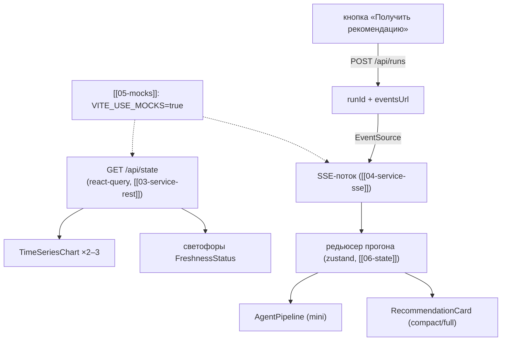

# 11 — Страница «Дашборд» (`/`)

Главный экран: тайм-серии ключевых тегов + светофоры свежести + кнопка «получить рекомендацию»
+ мини-конвейер + компакт-карточка. На нём прогоняются все 5 демо-сценариев
при приёмке домена.

## Scope

| Содержит (covers) | НЕ содержит (does NOT cover) |
| --- | --- |
| Компоновка блоков ниже; переключение демо-сценариев | логика компонентов 07–10 |
| Запуск прогона (`POST /api/runs`) и подписка на SSE | транспорт SSE, редьюсер прогона (их реализации — [[04-service-sse]], [[06-state]]) |
| Приёмочные критерии страницы (конец документа) | приёмку других страниц 12–16 |

## Триггер

- Открытие `/` (дефолтный роут): сразу `GET /api/state` (текущий режим + `freshness` + `lastRun`).
- Клик «Получить рекомендацию»: `POST /api/runs {kind, tPoint, overrides?, seed}` → 202
  `{runId, eventsUrl}` → открыть `EventSource` на `eventsUrl`.
- Смена сценария (селектор `ScenarioKind`): сброс прогона, обновление `t_point`/`overrides`
  пресета; повторный запуск — новой кнопкой (без автозапуска, чтобы оператор видел, что запускает).

## Поток данных



Вход страницы: `ScenarioKind` из селектора, `tPoint` (из `/api/state` по умолчанию), пустые
`overrides` (управляется на [[13-page-whatif]]). Выход: `runId` активного прогона в глобальном
стейте; компоненты страницы — чистые потребители ([[02-types]]: `TagPoint[]`, `DataFreshness[]`,
`AgentStep[]`, `Recommendation`).

## Макет

```text
┌─ Шапка: логотип «Refinery Copilot» · бейдж mocks/live · seed · светофоры свежести ─┐
│  ЛИМС ● ok · ПАК ● ok · ВАК ● warn   (DataFreshness[], ≤ 4 ч[^lims])        │
├─────────────────────────────────────────────────────────────────────────────┤
│ Сценарий: [normal ▾]  t_point: 2026-09-19 08:00   [ Получить рекомендацию ] │
├───────────────────────────────────────────┬─────────────────────────────────┤
│ Тайм-серии (syncGroup="dash")             │ Мини-конвейер (AgentPipeline    │
│  1) Q21 / ПАК-сера, порог ≤ 10 мг/кг,     │  variant="mini")                │
│     метки ЛИМС-факта, зоны сентинелов     │  ● Данные        ✓ 2.1 s        │
│  2) ЦЧ / T95 (ВАК), порог 360 °C          │  ● Качество     ✓ 2.1 s        │
│  (TimeSeriesChart, компонент 07)          │  ● Надёжность   ⠙ 3 с           │
│                                           │  ● Оптимизация  ○               │
│                                           │  ● Оркестратор  ○               │
├───────────────────────────────────────────┴─────────────────────────────────┤
│ Карточка (RecommendationCard compact)     │ Итог: run_status · run_id ·      │
│  «P8: 341.2 → 339.5 (−0.5 %)» · P10–P90   │ ссылка «полная карточка» → [[12-page-recommendation-card]]│
│  [ Примять как сценарий ]                 │                                  │
└──────────────────────────────────────────────┴──────────────────────────────┘
```

Порядок и состав блоков: селектор сценария + кнопка запуска; тайм-серии (левая колонка, ~60 %
ширины); мини-конвейер (правая колонка); карточка внизу. Карточка до первого прогона —
пустое состояние «Прогонов ещё не было — запустите рекомендацию» (не скелетон-заглушка данных).

## Состояния страницы

| Состояние | Признак | Отображение |
| --- | --- | --- |
| Идле | нет активного прогона | кнопка активна, конвейер все ○ |
| Прогон идёт | SSE `run_started`…`run_finished` | кнопка disabled («идёт прогон…»), конвейер live |
| Рекомендация | событие `recommendation` | карточка рекомендация, зелёная акцентная рамка |
| Отказ | событие `refusal` | красная отказ-карточка [[08-components-recommendation-card]] — штатно, не ошибка |
| Авария | `run_failed` | плашка `errorCode` + «повторить»; конвейер красный на текущем узле |
| Нет связи | heartbeat-таймаут (15 с) | бейдж «соединение потеряно, переподключение…» ([[04-service-sse]]) |

## Приёмочные критерии

> [!example] «Готово» проверяется по этому чек-листу

- [ ] При `VITE_USE_MOCKS=true` и выключенном backend страница полностью проходит **все 5 сценариев**
      (`normal, quality_risk, bad_data, sour_crude, stale_lims`) на фикстурах [[05-mocks]].
- [ ] Сценарий `stale_lims` завершается **видимым отказом**: красная карточка с `RefusalReason`,
      причины и текст объяснения — отказ штатен, тостов с «ошибкой» нет.
- [ ] Конвейер обновляется live: узлы последовательно ○ → ⠙ → ✓ в темпе мок-симулятора;
      у завершённых видны `duration_ms`.
- [ ] Тайм-серии рисуют полный 189k-ряд без фризов: LTTB-прореживание + `dataZoom` работают,
      порог 10 мг/кг виден как `markLine`, зоны сентинелов штрихованы.
- [ ] Светофоры свежести соответствуют `DataFreshness[]`: ок/warn/stale/missing раскрашены и
      с подсказкой возраста (e.g. «ЛИМС: 44 ч»).
- [ ] Кнопка «Получить рекомендацию» повторно нажимается после завершения прогона (новый `runId`,
      состояние конвейера и карточки сброшены).
- [ ] Режим live (`VITE_USE_MOCKS=false`) против реального backend: тот же поток — 202 → SSE →
      карточка; переподключение после рестарта бэкенда не ломает страницу.
- [ ] Отсутствие данных (`freshness: missing`, пустой ряд) отображается честным пустым
      состоянием («нет данных»), а не нулями.
- [ ] Ссылка «полная карточка» ведёт на [[12-page-recommendation-card]] с `runId` текущего прогона.

## Навигация и связь с другими страницами

| Переход | Откуда | Куда |
| --- | --- | --- |
| «полная карточка» | компакт-карточка | [[12-page-recommendation-card]] (с `runId`) |
| «примять как сценарий» | карточка | [[13-page-whatif]] (whatifDraft) |
| «мнемосхема» | шапка | [[14-page-mnemonic]] |
| «модели» / «данные» | шапка | [[15-page-models]] / [[16-page-data-reporter]] |

Роутинг — лёгкий (hash-роутер или react-router без вложенных лейаутов): 5–6 экранов,
тяжёлые роутеры не нужны. Активный прогон переживает
переход между страницами: `runId` и SSE-подписка живут в [[06-state]], не в компоненте страницы.

## Обработка ошибок запуска

| Ответ `POST /api/runs` | Поведение |
| --- | --- |
| 400 (неизвестный `kind`, невалидный пресет) | тост с `error.message`; кнопка остаётся активной |
| 503 `models_not_loaded` / `data_missing` | плашка «модели не загружены — выполните make train» + код ошибки |
| таймаут без 202 | тост «сервер не ответил»; повторный клик разрешён |

Ошибки SSE-потока не сбрасывают карточку последнего успешного прогона — она остаётся до нового запуска.

## Сценарий демо-прогона (чек-лист)

1. Открыть дашборд на моках; светофоры зелёные, конвейер в состоянии идле.
2. Прогнать `normal` → карточка рекомендации; проверки ✓ и уверенность видны в своих блоках.
3. Прогнать `quality_risk` → риск по сере виден на графике (ряд 2026 у порога 10 мг/кг) и в блоке «Риск».
4. Прогнать `sour_crude` → рекомендация меняется (другие крутки/блендинг) — «результат зависит от входа»[^demo].
5. Прогнать `bad_data` → конвейер предупреждает (warn в агенте данных), светофоры желтеют.
6. Прогнать `stale_lims` → отказ-карточка; «умение отказаться — часть решения».
7. «Примять как сценарий» → what-if: интерактивный пересчёт; вернуться, переключить live — тот же поток.

[^demo]: Результат должен меняться при изменении входов — сценарии не «жёсткие».

## Нефункциональные требования страницы

| Требование | Значение |
| --- | --- |
| Первый рендер при моках | без ожидания сети: фикстуры инлайн, `VITE_USE_MOCKS=true` |
| Ровный UI при live-потоке | узлы конвейера и карточка обновляются точечно, без мерцания канвы графиков |
| Память | один кэш рядов на тег; повторный прогон не дублирует TagPoint[] в памяти |
| Локализация | русский интерфейс; числа ru-RU; единицы из DTO |

[^lims]: ЛИМС публикуется через ≤ 4 ч после отбора пробы; светофоры это отражают.
