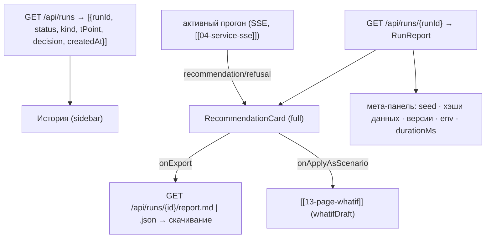

# 12 — Страница «Карточка рекомендации» (`/recommendation/:runId`)

Полная карточка рекомендации для выбранного прогона + история прогонов + экспорт отчёта MD/JSON
(«Воспроизводимость»: seed, хэши данных, версии — всё в `RunReport` [[07-run-report]]).

## Scope

| Содержит (covers) | НЕ содержит (does NOT cover) |
| --- | --- |
| Полный режим [[08-components-recommendation-card]] (все 7 блоков + альтернативы) | генерация карточки (ядро/оркестратор) |
| История прогонов: список из `GET /api/runs` с фильтром по исходу | запись артефактов (ядро → `artifacts/runs/`, P3) |
| Экспорт: ссылки на `GET /api/runs/{id}/report.md` и `.report.json` | рендер Markdown на клиенте (файл скачивается как есть) |
| Сравнение «выбранный прогон ↔ соседние» по ключевым числам | пересчёт старых прогонов (детерминизм гарантирует ядро: один seed → одно решение[^det]) |

## Триггер

- Навигация с дашборда [[11-page-dashboard]] («полная карточка» текущего прогона) — `/recommendation/{runId}`.
- Клик по строке истории — замена `runId` в URL (карточка перезагружается из кэша react-query).
- Прямая ссылка `/recommendation/{runId}` (шеринг внутри команды).
- Живой вариант: `runId` активного прогона ещё не завершён — страница подписывается на SSE
  [[04-service-sse]] и карточка дозаполняется по событиям `recommendation` / `refusal`.

## Поток данных



Вход: `runId` (роут-параметр). Выход: выбранная альтернатива → черновик what-if; выбранный
экспорт → файл. Все данные — контракты [[02-types]]: `RunReport`, `Recommendation`, `AgentStep[]`.

## Макет

```text
┌─ Шапка: «Карточка рекомендации» · run_id · статус-бейдж (completed/refused) ┐
├──────────────┬──────────────────────────────────────────────────────────────┤
│ ИСТОРИЯ      │ Мета-панель: seed 42 · contract 1.0.0 · core 0.1.0 ·          │
│ (sidebar)    │ data_hashes (свёрнуто) · LLM off · 12.4 s                     │
│ ▸ 08:05 ✓    ├──────────────────────────────────────────────────────────────┤
│ ▸ 07:50 ✖отказ│ RecommendationCard mode="full":                              │
│ ▸ 07:30 ✓    │  состояние → риск → действие → эффект → ограничения →         │
│  фильтр:     │  уверенность → объяснение + альтернативы (Парето)             │
│  [все|✓|✖]   │  [ Примять как сценарий ] [ Экспорт MD ] [ Экспорт JSON ]     │
│              │ Сверху карточки: сценарий kind + overrides + подпись-дисклеймер│
└──────────────┴───────────────────────────────────────────────────────────────┘
```

Блоки sidebar-истории: `createdAt` (время), иконка исхода ✓ рекомендация / ✖ отказ / ⚠ failed,
`kind` сценария бейджем. Активная строка подсвечена; фильтр — клиентский (список ≤ десятков строк).

## Сравнение прогонов (мини-фича)

Над карточкой — сворачиваемая строка «Сравнить с…»: выбор второго прогона из истории →
таблица «параметр | этот прогон | выбранный»: `p50` по целям, `actions[0].recommended_value`,
`costIndex` альтернативы, исход. Без графиков — чистые числа из двух `RunReport` уже в кэше.

## Экспорт отчёта

| Действие | Эндпоинт ([[01-p1-rest-sse]] §2.1) | Формат |
| --- | --- | --- |
| «Экспорт MD» | `GET /api/runs/{runId}/report.md` | `text/markdown`, файл `{run_id}.md` — карточка + трейс агентов + метрики |
| «Экспорт JSON» | `GET /api/runs/{runId}/report.json` | `RunReport` 1:1 c артефактом `artifacts/runs/{run_id}.json` |

- Кнопки — обычные ссылки `download` на [[03-service-rest]] (не перерисовываем и не конвертируем на клиенте).
- Мета-панель обязательно показывает `seed`, `data_hashes` (свёрнуто, с возможностью скопировать), `versions` —
  воспроизводимость проверяется не выходя со страницы[^det].

## Приёмочные критерии

- [ ] Оба исхода отображаются корректно на реальных данных: прогон `normal` → зелёная карточка
      рекомендаций со всеми 7 блоками; прогон `stale_lims` → красная отказ-карточка с
      `RefusalReason` и деталями (на моках [[05-mocks]] и в live).
- [ ] Экспорт MD открывается как читаемый Markdown (заголовки, таблица агентов, карточка);
      экспорт JSON валиден и совпадает по полям с `RunReport` [[07-run-report]].
- [ ] История прогонов подгружается с `GET /api/runs`, фильтр по исходу работает, клик по строке
      меняет карточку без перезагрузки страницы.
- [ ] Прямая ссылка `/recommendation/{runId}` открывает карточку по произвольному старому прогону.
- [ ] Кнопка «Примять как сценарий» уводит на [[13-page-whatif]] с предзаполненными ползунками
      (значения `actions[].recommendedValue`); для отказ-карточки кнопка скрыта.
- [ ] Мета-панель показывает seed/хэши/версии; при их отсутствии (мок-фикстура) — честное «—».
- [ ] Пустое состояние «прогонов нет» (чистый бэкенд) — заглушка с подсказкой запустить прогон
      на дашборде, без ошибок в консоли.
- [ ] Во время активного прогона карточка дозаполняется live от SSE и не дублируется с
      REST-данными (один источник на момент времени — редьюсер [[06-state]]).

## Запросы страницы (сигнатуры service layer)

```ts
// [[03-service-rest]] — сигнатуры, используемые только этой страницей
listRuns(): Promise<RunSummary[]>                       // GET /api/runs
getRunReport(runId: string): Promise<RunReport>         // GET /api/runs/{run_id}
reportUrl(runId: string, fmt: 'md' | 'json'): string    // ссылка для кнопок экспорта
```

react-query ключи: `['runs']` (список, `staleTime: 30 с`) и `['runs', runId]` (отчёт,
`staleTime: ∞` — завершённые прогоны неизменны). Активный (незавершённый) прогон не читается
из REST — только из SSE-редьюсера [[06-state]], чтобы не смешивать два источника.

## Состояния страницы

| Состояние | Признак | Отображение |
| --- | --- | --- |
| Загрузка истории | `listRuns` в полёте | скелетон строк sidebar (без скелетона карточки) |
| Загрузка отчёта | `getRunReport` в полёте | спиннер на месте карточки |
| 404 | неизвестный `runId` | «прогон не найден» + ссылка на историю |
| Активный прогон | `status` started/running | карточка live из SSE, в истории строка со спиннером |
| Пусто | список пуст | заглушка «прогонов нет — запустите на дашборде» |

## Sidebar истории — поля строки

| Поле `RunSummary` | Рендер |
| --- | --- |
| `createdAt` | время «08:05» (дата — при смене суток в списке) |
| `status` | иконка: ✓ completed / ✖ refused / ⚠ failed / ⠙ running |
| `kind` | бейдж сценария (норма / риск-2026 / …) |
| `decision` | короткое слово «рекомендация» / «отказ» (для running — «идёт…») |
| `tPoint` | tooltip строки |

Клик по строке меняет `runId` в URL (history replace) — «назад» браузера ведёт по истории просмотров.
Обновление списка — по завершении активного прогона (инвалидация `['runs']`), не по таймеру.

Доступность: строки истории — кнопки с понятным `aria-label` («прогон 08:05, отказ, сценарий
stale_lims»); фокус после клика остаётся на списке — карточка меняется без «прыжка» скролла.

## Что содержит экспортный MD (ожидание от отчёта ядра)

Заголовок с `run_id`/seed → таблица трейса агентов (`AgentStep`: роль, длительность,
`input_digest`) → карточка рекомендации целиком → таблица проверенных ограничений → alternatives/Парето →
при отказе: причины и детали. Страница экспортирует файл «как есть»: артефакт собирает ядро
(`report/`, P3), формат описан в [[07-run-report]] и [[12-run-report]].
Вложение даёт «воспроизводимость одним кликом».

[^det]: Воспроизводимость = одинаковые численные результаты при одинаковом состоянии; seed фиксирован.
