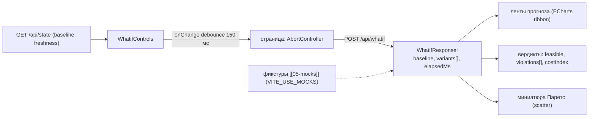

# 13 — Страница «Что если» (`/whatif`)

Полноэкранный симулятор: слева ползунки управляемых ([[10-components-whatif-controls]]), справа
мгновенный прогноз качества, вердикты по ограничениям и миниатюра Парето «запас качества ↔
стоимость». Отклик < 200 мс на моках[^sla] — ощущается «мгновенным» в демо-режиме.

## Scope

| Содержит (covers) | НЕ содержит (does NOT cover) |
| --- | --- |
| Компоновка «ползунки ↔ результат»; оркестрация debounced-запросов `POST /api/whatif` | расчёт прогноза и feasibility (ядро, синхронно < 50 мс[^sla]) |
| Рендер лент P10–P90 по целям, маркеров отбраковки | генерация Парето-фронта (агент optimization; миниатюра — только отображение) |
| Миниатюра Парето + «показать полный фронт» (переход к прогону-карточке) | добавление своих точек во фронт (фронт строится ядром на прогоне) |
| Пресеты сценариев; черновик ползунков в URL/стейте (шеринг) | обучение/переоценка моделей — запрещено странице |
| Обязательная подпись «модельная оценка…»[^dop] | проверка паспортных ограничений оборудования (не выданы[^dop]) |

## Триггер

- Открытие `/whatif`: `GET /api/state` → базовая линия (`baseline` теги + текущий режим), черновик
  `whatifDraft` из [[06-state]] (если пришли «примять как сценарий» с [[08-components-recommendation-card]]) — подставляется.
- Движение ползунка: debounce 150 мс → `POST /api/whatif {tPoint, overrides, variants?}`.
- Кнопка «прогнать до 8 вариантов» (сравнение пресетов): один запрос с `variants[]` ≤ 8 (батч, см. [[01-p1-rest-sse]]).
- Кнопка «сброс»: `overrides = baseline`, один запрос на подтверждение.

## Поток данных



Вход: `overrides: Record<string, number>` (ключи — только управляемые из реестра
[[10-components-whatif-controls]]), опционально `variants[]`. Выход — рендер `WhatifResponse`:
`baseline[]` и `variants[].quality[]` (`{target, p10, p50, p90, specRisk, unit}`), `feasible`,
`violations[]`, `costIndex`, `elapsedMs`. Типы — зеркала [[02-types]].

## Макет

```text
┌─ Шапка: «Что если» · t_point · бейдж «расчёт 31 мс» · [норма][риск-2026][сброс] ┐
├──────────────────────────────┬──────────────────────────────────────────────────┤
│ ПОЛЗУНКИ (~35 % ширины)      │ ПРОГНОЗ (~65 %)                                  │
│ WhatifControls:              │  Сера, мг/кг:  лента P10–P90 vs базовая линия    │
│  Гидроочистка P8/T11/F19     │   markLine 10 мг/кг; spec_risk-бар               │
│  АВТ: расход/T печи/давление │  ЦЧ:  лента + порог ≥ 51 (49 зимнее)             │
│  Блендинг: доли + присадка   │  T95: лента + порог 360 °C                       │
│  violations → красная рамка  │  Плотность: коридор 820–845                      │
│  costIndex-бар внизу         │ ────────────────────────────────────────────────  │
│                              │ Парето-миниатюра: X = стоимость, Y = запас        │
│                              │  качества; ● допустимые, ✕ отбракованные,        │
│                              │  ● knee — «показать полный фронт» → [[12-page-recommendation-card]]       │
│                              │ ⚠ «Модельная оценка; история не подтверждает     │
│                              │   действий, которых в ней не было»[^dop]          │
└──────────────────────────────┴──────────────────────────────────────────────────┘
```

## Поведение и правила

1. **Живой пересчёт**: один запрос в полёте; новый `onChange` абортит предыдущий
   (`AbortController`); `elapsedMs` из ответа — бейдж в шапке (честный SLA-аргумент).
2. **Ограничения**: `violations[]` подсвечивают виноватые ползунки; над прогнозом — сводная
   плашка «допустимо ✓ / нарушает N ограничений ✕» с перечнем. Отбраковка видна **мгновенно** —
   ключевое свойство безопасности.
3. **Ленты прогноза**: лента P10–P90 варианта + пунктир базовой линии p50; расхождение видно
   без чтения чисел. Ширина ленты — честная неопределённость (конформ), не декорация.
4. **Парето-миниатюра**: точки вариантов текущей сессии what-if (X = `costIndex`, Y = мин-запас
   до спецификации по целям); недоминируемые соединены линией, knee выделен. Клик по точке —
   подставить её overrides в ползунки. Полный фронт с рангами — на карточке прогона ([[12-page-recommendation-card]]).
5. **Батч-режим**: до 8 `variants[]` одним запросом (лимит 400/422, [[01-p1-rest-sse]] §2.1) — «веер» лент на одном
   графике, легенда по пресетам.
6. Страница **не** предлагает «применить на установке» — только анализ (изменение режима вне зоны ответственности системы).

## Приёмочные критерии

- [ ] На моках ([[05-mocks]]) полный цикл «движение ползунка → обновление прогноза» < 200 мс;
      бейдж `elapsedMs` отображает время из ответа.
- [ ] Все 8 групп ползунков работают: P8/T11/F19, три переменные АВТ, доли блендинга (Σ = 100 %
      держится автоматически), присадка ограничена 3 %.
- [ ] Пересечение ограничения подсвечивает прогноз и конкретный ползунок (`violations[]`),
      плашка-вердикт меняется на красную без перезагрузки.
- [ ] Пресеты (`норма`, `риск-2026`, `сернистая нефть`) подставляют полные наборы значений
      одним кликом; «сброс» возвращает базовый режим.
- [ ] «Примять как сценарий» с карточки ([[08-components-recommendation-card]]) открывает страницу
      с уже выставленными значениями и одним выполненным пересчётом.
- [ ] Парето-миниатюра рисует допустимые/отбракованные точки и knee; клик по точке обновляет ползунки.
- [ ] Подпись «модельная оценка…» присутствует всегда и не скрыта фолдом.
- [ ] Спорные значения (выход за p2/p98, Σ ≠ 100 % на полпути) не блокируют запрос — бэкенд
      отвечает вердиктом; локальная жёлтая индикация работает.
- [ ] Страница работает без backend на фикстурах; 400/422/503 от live-бэкенда показываются
      тостом с `error.message` без падения страницы.

## Шеринг состояния (query-параметры)

```ts
// черновик ползунков кодируется в URL для воспроизводимой демонстрации:
// /whatif?tp=2026-09-19T08:00:00Z&o=24-2000.P8:339.5,blend_additive_pct:1.5
type WhatifQuery = { tp?: string; o?: Record<string, number> }   // парсинг/сериализация — utils, не роутер
```

- Открытая ссылка восстанавливает ползунки и выполняет один пересчёт — «пришли с одинаковыми
  входами, увидели одинаковые числа» (в духе воспроизводимости: одинаковые входы → одинаковые результаты).
- Изменение ползунков обновляет query-параметр с тем же дебаунсом (replaceState, без истории браузера).

## Состояния страницы

| Состояние | Отображение |
| --- | --- |
| Нет baseline (`/api/state` пуст/503) | заглушка «нет текущего состояния: выполните make data» |
| Запрос в полёте | спиннер у заголовка прогноза; **прошлый** прогноз не мигает и не пустеет |
| 400/422 (неуправляемый override, > 8 вариантов) | тост с `error.message`; ползунки остаются в текущем положении |
| 503 `models_not_loaded` | плашка «модели не загружены — make train» вместо прогноза |
| Прервано (AbortController) | тихо, без тоста — нормальное поведение при быстром движении ползунков |

## Производительность

- Ленты и миниатюра Парето — два ECharts-инстанса; пере-рендер опции только по изменённым сериям
  (`notMerge: false`, точечные `setOption`), без пересоздания канвы.
- `overrides` держится локально (useReducer страницы), глобальный `whatifDraft` в [[06-state]]
  обновляется только при входе/выходе со страницы — ползунки не перерисовывают дашборд.

## Ценность страницы

| Свойство | Чем обеспечивает страница |
| --- | --- |
| Наглядность | живые ползунки с мгновенным прогнозом и «веером» лент |
| Понимание динамики | горизонт 0–3 ч и лента P10–P90 видны при движении крутки[^dop] |
| Безопасность | нарушения ограничений подсвечиваются мгновенно, до всякого «применения» |
| Оптимизация | миниатюра Парето «запас качества ↔ стоимость» (присадка ×100[^x100]) |
| Объяснимость | подписи эффектов крутки — из посчитанных фактов, не «магия» |

[^x100]: 1 т присадки в 100 раз дороже 1 т ДТ — стоимостной прокси.

[^sla]: [[01-p1-rest-sse]] C.1: what-if синхронно, цель < 50 мс (модели в памяти); приёмка фронта — < 200 мс на моках.
[^dop]: Модельный блендинг с явными допущениями; подпись обязательна; паспортных ограничений оборудования нет.
