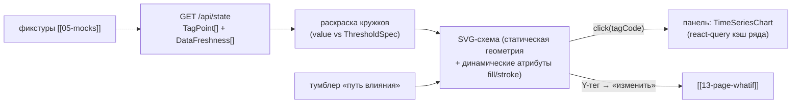

# 14 — Страница «Мнемосхема» (`/mnemonic`)

Живая SVG-схема цепочки **АВТ → гидроочистка 24-2000 → блендинг** — аналог SCADA-мнемосхем:
датчики-кружки с цветом по порогам, клик по датчику → его временной ряд, режим «путь влияния»
управляющей переменной на качество. Понятна технологам.

> [!warning] Точность схем
> Исходные заводские схемы (позиции тегов АВТ К-1/К-2/К-10, цепочка управляемых переменных)
> не трассируемы 1:1 — схема рисуется **упрощённо**,
> опираясь на позиции тегов из схем и «цепочку управляемых» (пометки Y). Точная трассировка
> — вне scope; схемы — стилизация, а не чертёж.

## Scope

| Содержит (covers) | НЕ содержит (does NOT cover) |
| --- | --- |
| Упрощённая SVG-схема: ЭЛОУ/печи/К-1/К-2/К-10 → Р-201/Р-202 → резервуары блендинга | точные чертежи; гидравлика; все 71 тег АВТ (рисуем ключевые) |
| Датчики-кружки: цвет по порогам/диапазону, tooltip со значением и единицей | привязка значений «на глаз»: цвет только из `ThresholdSpec` |
| Клик по датчику → панель с `TimeSeriesChart` ([[07-components-timeseries]]) | пересчёт/фитинг данных — только отображение из `/api/state` |
| Режим «путь влияния»: подсветка дуги крутка → сера/ЦЧ товарного | verdicts ограничений (берём из карточки/whatif) |
| Пометка Y (управляемые) и ЛК (лабораторный контроль)[^y] | мульти-сценарий поверх мнемосхемы (сценарии — на дашборде) |

## Триггер

- Открытие `/mnemonic`: `GET /api/state?tags=…` (ключевые теги схемы) → раскраска кружков.
- Клик по датчику-кружку → открытие боковой панели с рядом (без смены роута).
- Тумблер «путь влияния» + выбор одной из управляемых (`P8`, `T11`, `F19`, переменные АВТ,
  присадка) → подсветка маршрута влияния.
- Клик по управляемому (Y) → «изменить здесь» → переход на [[13-page-whatif]] с этим ползунком.

## Поток данных



Вход: `TagPoint[]` по списку тегов схемы, `DataFreshness[]` для честных «нет данных»,
реестр порогов из [[07-components-timeseries]]. Выход: выбранный тег (панель), выбранная
управляемая (переход в what-if). Типы — [[02-types]].

## Макет

```text
┌─ Шапка: «Мнемосхема» · t_point · [путь влияния: off | P8 | T11 | F19 | АВТ | присадка] ┐
├──────────────────────────────────────────────────────┬─────────────────────────────┤
│ SVG (viewBox ~1200×640, панорамирование не нужно)     │ Панель ряда (по клику):      │
│                                                       │  «Q21 — сера, 8.4 мг/кг»     │
│  [ЭЛОУ]─→[Печи П-1/1,П-1/2,П-3]─→[К-1]═▶[К-2]═▶[К-10]│  TimeSeriesChart + порог     │
│      T55 ●   F65 ●  (Y расход нефти)  W70 ●           │  + бейдж свежести источника  │
│        │                                              │  «ЛИМС 44 ч · stale»         │
│        ▼                                              │                              │
│  [Гидроочистка 24-2000: Печи → Р-201 → Р-202]         │ (сворачивается по ✕)         │
│      T5 ●  P13 ●  Q21 ●  ПАК-сера ●   (Y: P8,T11,F19)│                              │
│        │                                              │                              │
│        ▼                                              │                              │
│  [Блендинг: ДТ ГО + керосин + газойль → товарный]     │                              │
│   доли-санки ▓▓▓ + присадка ● ≤ 3 %  → ЦЧ ● ≥ 51      │                              │
└───────────────────────────────────────────────────────┴─────────────────────────────┘
```

Блоки схемы (слева направо по ходу процесса): ЭЛОУ/нефть → печи АВТ → колонны К-1/К-2/К-10 →
гидроочистка (печи → Р-201/Р-202) → блендинг (три компонента + присадка → товарный резервуар).
На рёбрах — стрелки потока; режим «путь влияния» красит дуги от выбранной крутки по ходу к
цели качества (сера/ЦЧ товарного).

## Датчики-кружки

| Свойство | Правило |
| --- | --- |
| Форма | кружок r = 10 на SVG; управляемые (Y) — кружок с ободком и иконкой ползунка, ЛК (лабораторный контроль) — квадрат-иконка «колба» |
| Цвет | зелёный — в допуске; жёлтый — p10–p90 рабочий край/предупреждение; красный — за порогом спецификации; серый — `value: null` или `freshness: missing/stale` («не верим») |
| Tooltip | `tag`, значение + единица, время отсчёта, статус свежести источника |
| Пороги | те же `ThresholdSpec`, что и на графиках (сера ≤ 10, T95 ≤ 360, ЦЧ ≥ 51/49, плотность 820–845, p2/p98-зоны) — единый источник порогов, не копия |
| Клик | панель ряда справа; повторный клик — закрыть панель |
| Обязательный минимум кружков | ~20: T55, F65, W70, P22, T5, T6, T11, P13, F19, F26, Q21, ПАК-сера, ПАК-D15, ЛИМС-факты (сера/ЦЧ), доли бленда, присадка, ЦЧ товарного, T95 товарного |

## Режим «путь влияния»

1. Выбор управляемой (например, `P8` — T ГСС на входе Р-202) — кружок увеличивается, остальные гаснут.
2. Подсвечивается дуга: `P8 → реактор Р-202 → Q21/ПАК-сера → блендинг → ЦЧ/сера товарного`
   (маршрут — статический словарь в коде схемы, по «цепочке управляемых»[^y]).
3. На дуге подпись эффекта из последней карточки/what-if: «−1,7 °C ⇒ сера −0,5 мг/кг» (только
   уже посчитанные факты, не оценка на лету).
4. Для АВТ-крутов путь длиннее (АВТ → прямогонный ДТ → гидроочистка → товарный) и помечается
   «вероятно, через промежуточный резервуар»[^res] — честная неопределённость на экране.

## Приёмочные критерии

- [ ] Схема отрисовывается как SVG из статической геометрии + динамической раскраски; никакого
      растрового скана не вставлено; подпись «упрощённая схема» присутствует.
- [ ] Датчики-кружки окрашены по значениям из `/api/state`: зелёный/жёлтый/красный/серый;
      при `VITE_USE_MOCKS=true` — по фикстурам сценария (в `bad_data` серые/жёлтые кружки видны).
- [ ] Клик по датчику открывает его временной ряд ([[07-components-timeseries]]) в панели,
      включая пороги и свежесть источника; закрытие панели работает.
- [ ] Управляемые (Y) визуально отличимы (ободок + иконка) и кликабельны до [[13-page-whatif]]
      с предвыбранным ползунком.
- [ ] Режим «путь влияния» подсвечивает маршрут выбранной крутки до цели качества; «off»
      возвращает базовую раскраску.
- [ ] Мёртвые теги (D10 — 99,99 % сентинелов[^d10]) рисуются серыми с tooltip «мёртвый канал» —
      не выглядят «рабочими».
- [ ] Tooltip/панель показывают единицы из данных (`unit`), значения — как есть; `null` → «нет данных».
- [ ] Панорамирование/масштаб не обязательны: схема целиком влезает в экран 1280×720 без прокрутки.

## Структура кода схемы

```ts
// src/features/mnemonic/ — геометрия статична, динамика — только атрибуты
type SensorDef = { tag: string; x: number; y: number; role: 'kip' | 'lims' | 'pak' | 'vak';
                   managed?: boolean; labControl?: boolean };   // позиции — из исходных схем (упрощённо)
type InfluencePath = { varKey: string; route: string[]; note?: string };
//   route — последовательность tag'ов дуги «путь влияния»; note — пометка «через резервуар»[^res]
// MnemonicSvg({ sensors, influencePaths }) — чистая SVG-геометрия (viewBox 1200×640)
// useSensorColors(tagPoints, thresholds) → Map<tag, 'ok'|'warn'|'alarm'|'unknown'>
```

- Геометрия — JSX/SVG-компоненты без состояния; раскраска и клики приходят пропсами → схему
  легко проверить тестом-снапшотом и переиспользовать в других материалах проекта.
- Маппинг «позиция на схеме ↔ тег CSV» ведётся в едином `sensors`-списке с комментарием-источником
  (позиции по исходным схемам К-1/К-2/К-10); спорные позиции помечаются комментарием «гипотеза по данным» (T5 и др.[^kips]).

## Обновление данных

- Значения — из уже загруженного состояния ([[06-state]]); авто-обновление не нужно: данные
  исторические, `t_point` фиксирован. Рефреш — кнопкой (инвалидация react-query), не таймером.
- При смене демо-сценария на дашборде мнемосхема перекрашивается только после явного рефреша
  (исключаем «пляску» цветов на экране во время демонстрации).

[^kips]: Справочник КИП 24-2000 расходится с данными (17 из 26 кодов) — позиции фиксируются по поведению значений.
[^y]: Управляемые помечены «Y» на схемах АВТ; точки ЛК — лабораторный контроль.
[^res]: Между АВТ и гидроочисткой, вероятно, промежуточный резервуар (допущение).
[^d10]: D10 — 99,99 % сентинелов, тег мёртв.
