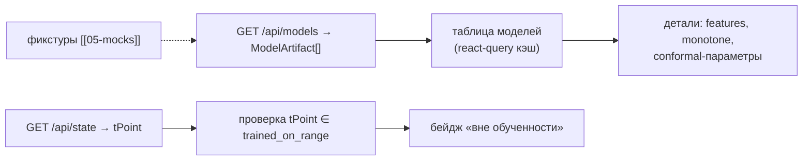

# 15 — Страница «Модели» (`/models`)

Реестр моделей: манифесты `ModelArtifact` ([[08-model-artifact]]), метрики на **временном**
holdout (time-split с gap ≥ 3 ч, никакого перемешивания[^ts]), эмпирическое покрытие конформных
интервалов, диапазоны обученности с предупреждением «вне обученности». Каждое число —
факт-чекинг качества прогноза, а не маркетинг.

## Scope

| Содержит (covers) | НЕ содержит (does NOT cover) |
| --- | --- |
| Таблица/карточки `ModelArtifact[]` из `GET /api/models` | обучение/переобучение, трiggер пайплайна (P4/P5 — вне фронта) |
| Метрики holdout: WAPE/MAE/pinball + coverage | пересчёт метрик на клиенте |
| Диапазоны `trained_on_range` + предупреждение «вне обученности» | вердикт отказа (ядро, `out_of_training_domain`) — здесь только предупреждение-инфо |
| Важности признаков (глобальный SHAP-артефакт, если отдан) | локальные SHAP карточки (см. [[08-components-recommendation-card]]) |
| Пометки active-модели и версии ядра | редактирование реестра |

## Триггер

- Открытие `/models`: `GET /api/models` → `ModelArtifact[]` (react-query, [[03-service-rest]]).
- Раскрытие карточки цели — ленивая загрузка деталей манифеста (features, monotone constraints).
- Сравнение с текущим моментом: бейдж «вне обученности» считается на клиенте по `t_point`
  активного состояния vs `trained_on_range` (чистая дата-функция, без запросов).

## Поток данных



Вход: `ModelArtifact[]` ([[02-types]]: `artifactId, target, algorithm, quantiles, modelUri,
conformal, coverage, metrics, trainedOnRange, features, monotoneConstraints, createdAt, seed,
coreVersion, active`), `t_point` состояния. Выход: нет мутаций — страница read-only.

## Макет

```text
┌─ Шапка: «Модели» · core 0.1.0 · контракт 1.0.0 · моделей: 4 · бейдж mocks/live ┐
├─────────────────────────────────────────────────────────────────────────────────┤
│ Карточка цели (×4: sulfur · t95 · d15 · cetane)                                 │
│  ● sulfur — lightgbm_quantile  [active]   обучение: 2023-01-01 → 2026-06-30     │
│    квантили 0.1/0.5/0.9 · конформ enbpi · coverage 0.83 ✓ (≈0.8)                │
│    WAPE 6.1 % · MAE 0.52 · pinball_p50 0.35      seed 42 · sha256-хэш (свёрнуто) │
│    признаки: T5, T11, lims_age_h, cat_age_days   монотонности: T5 → +1          │
│    [⚠ вне обученности] — если t_point состояния > 2026-06-30                    │
├─────────────────────────────────────────────────────────────────────────────────┤
│ Пояснение-каллаут: «holdout — хвост периода (2026), time-split с gap ≥ 3 ч,     │
│ без перемешивания»[^ts] · подпись «прогноз качества — модельная оценка»          │
└─────────────────────────────────────────────────────────────────────────────────┘
```

Поля карточки → колонки: цель (`target` + человеческое имя и единица из спецификации),
алгоритм, active-бейдж (одна active на target — инвариант реестра[^reg]), квантили, метрики из
`metrics{}`, `coverage` с индикатором «≈ 0.8?» (покрытие 80 %-интервала должно быть ≈ 80 % —
это и есть проверка честности интервалов), `trainedOnRange` как дата-диапазон, `seed`, `createdAt`.

## Предупреждение «вне обученности»

- Если `t_point` состояния выходит за `trained_on_range.{start,end}` (или за p2–p98 модельных
  диапазонов, отданных в `/api/state`) — жёлтый бейдж на карточке и в шапке страницы:
  «текущее состояние вне диапазона обученности — прогнозам доверять с осторожностью».
- Это **информационное** предупреждение фронта; вердикт отказа `out_of_training_domain`
  принимает только оркестратор ([[04-recommendation]], `refusal`) — страница не отменяет
  рекомендации и не блокирует навигацию.
- Даты сравниваем в UTC ISO-строках (время — ISO 8601 UTC).

## Важности признаков (SHAP, если есть)

- Если бэкенд отдаёт глобальный SHAP-артефакт (прекомпьют `make train` в `artifacts/` и отдаётся
  в составе манифеста/доп-эндпоинте) — горизонтальный bar-chart top-признаков (mean |SHAP|).
- Нет артефакта → блок скрывается целиком (не рисуем заглушку с выдуманными весами);
  в `features[]` просто показываем список.

## Приёмочные критерии

- [ ] Данные приходят с `GET /api/models` и только оттуда (моки [[05-mocks]] при
      `VITE_USE_MOCKS=true`); страница не хардкодит ни одной метрики.
- [ ] По каждой цели отображены: метрики time-split (WAPE/MAE/pinball), coverage с индикатором
      «≈ 0.8», диапазон обученности, seed, active-бейдж.
- [ ] Пустые/отсутствующие значения (`metrics: {}`, нет SHAP-артефакта) обработаны: «—» или
      скрытый блок, без NaN/undefined в разметке и без падений.
- [ ] 503 `models_not_loaded` от live-бэкенда → страница заглушки «реестр пуст: выполните
      make train» с кодом ошибки, без crash.
- [ ] Бейдж «вне обученности» корректно появляется/исчезает при смене `t_point` (проверено
      на моках с датой за пределами `trained_on_range`).
- [ ] Пояснение про time-split/gap ≥ 3 ч присутствует как каллаут (анти-«случайный сплит»[^ts]).
- [ ] Раскрытие деталей (features, monotone constraints, conformal-параметры) работает лениво
      и не блокирует таблицу.

## Индикаторы метрик → цвета

| Метрика | Индикатор | Логика |
| --- | --- | --- |
| `coverage` | зелёный/жёлтый | |coverage − 0.8| ≤ 0.05 → зелёный («интервалы честные»); иначе жёлтый с подсказкой |
| WAPE | число + полоса | полоса от 0 до 25 %; без вердиктов «хорошо/плохо» — пороги не декларированы |
| pinball | число | чисто сравнительное между целями не применяем (разные единицы) |
| `monotone_constraints` | бейджи «T5 → +1» | физическая правдоподобность модели |
| `core_version` | бейдж | несовпадение с `/api/health` → предупреждение «реестр и api из разных сборок» |

## Состояния страницы

| Состояние | Отображение |
| --- | --- |
| Загрузка | скелетон карточек целей |
| Пустой реестр / 503 `models_not_loaded` | заглушка «модели не обучены: make data → make train» + код ошибки |
| Часть целей отсутствует | карточки существующих целей; для отсутствующих — строка «модель не обучена» (не скрытие) |
| Расхождение версий | жёлтый бейдж на конкретной карточке, остальные цели работают |

## Маппинг «манифест ↔ страница» (поле за полем, без домысливания)

| Поле `ModelArtifact` [[08-model-artifact]] | Где на странице |
| --- | --- |
| `artifact_id`, `algorithm`, `active` | заголовок карточки + бейдж active |
| `target` | человеческое имя цели + единица (сера мг/кг, T95 °C, D15 кг/м³, ЦЧ пункт) |
| `quantiles`, `conformal` | строка «квантили 0.1/0.5/0.9 · конформ enbpi» |
| `coverage` | индикатор «≈ 0.8?» (см. таблицу индикаторов) |
| `metrics` (WAPE/MAE/pinball из `metrics.json`) | блок метрик holdout |
| `trained_on_range` | дата-диапазон + основа бейджа «вне обученности» |
| `features`, `monotone_constraints` | раскрытие «детали» |
| `seed`, `created_at`, `core_version` | подвал карточки (воспроизводимость) |
| `model_uri` | НЕ показываем пользователю (путь на диске) — tooltip для разработчика |

Страница — read-only витрина P5: она никогда не пишет в `artifacts/` и не предлагает «переобучить»
(обучение — только пайплайн `make train`, ядро в рантайме не обучает[^reg]).

## Как читать метрики (каллаут внизу страницы)

> [!info] Как читать метрики
> Holdout — последние месяцы истории (2026), отрезанные **по времени** с зазором ≥ 3 ч от
> обучения; метрики считаются пайплайном один раз и публикуются в `metrics.json`. Coverage —
> доля попаданий факта в интервал P10–P90: для 80 %-интервала честное значение ≈ 0.8. Прогноз
> страницы «Модели» — доказательство качества, а не маркетинг: каждое число кликабельно до
> источника (артефакт/хэш данных).

[^ts]: Валидация только по времени; случайное перемешивание не допускается.
[^reg]: Реестр держит один `active`-артефакт на цель; расхождение версий — артефакт игнорируется.
