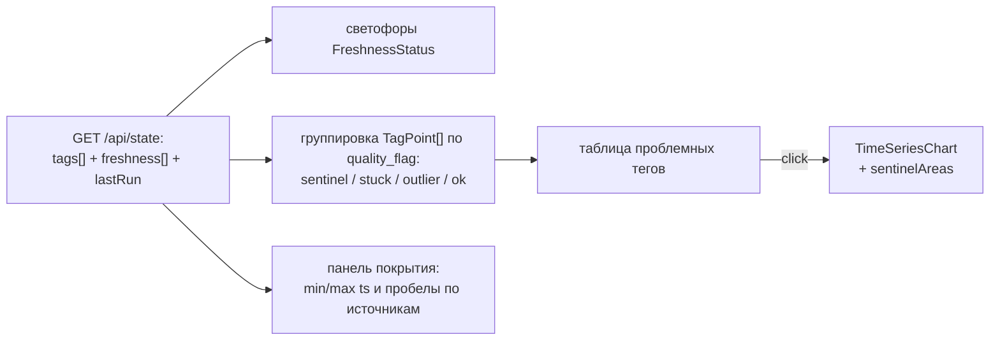

# 16 — Страница «Репортёр данных» (`/data`)

Витрина качества данных: сентинелы, залипания, мёртвые каналы, светофоры свежести источников,
покрытие периодов. Источник — `GET /api/state` (текущее состояние + `freshness` + флаги
`quality_flag`) и подтверждённые факты о данных. Чистку данных страница
**не делает** — только показывает (писатель — data-pipeline[^clean]).

## Scope

| Содержит (covers) | НЕ содержит (does NOT cover) |
| --- | --- |
| Светофоры источников: ЛИМС / ПАК / ВАК / КИП по точкам контроля (`DataFreshness[]`) | пересчёт возраста/статусов (ядро на `t_point`; фронт доверяет DTO [[02-data-freshness]]) |
| Таблица проблемных тегов: сентинелы, залипания, зашкалы, мёртвые | исправление/маскирование данных |
| Панель «покрытие источников»: календари доступности (ПАК-сера с 2023, D15 с 03.2025[^pak]) | чтение сырых CSV/XLSX (доступ к данным только через ядро, правило 4 домена) |
| Клик по проблемному тегу → ряд с штриховкой зон ([[07-components-timeseries]]) | детектор аномалий в рантайме (параметры из артефактов, агент `data`) |
| Справка-обоснование: почему сентинелы/залипания — факты о данных | правка справочника КИП (расхождение 17 из 26 — фиксируется как находка[^kips]) |

## Триггер

- Открытие `/data`: `GET /api/state` (все ключевые теги + `freshness`) → таблицы и светофоры.
- Выбор точки контроля (`point_id`) в светофорах → детальный бейдж: возраст, пороги
  `warnAfterH`/`staleAfterH`, время последнего отбора и доступности (`available_ts = sample + ≤4 ч`[^lims]).
- Клик по тегу из таблицы проблем → график ряда.

## Поток данных



Вход: `TagPoint[]`, `DataFreshness[]` ([[02-types]]); статусы — enum `FreshnessStatus`
(`ok / warn / stale / missing`, [[01-enums]]). Выход: выбранный тег (график). Никаких новых
типов — расхождения типов считаются багом контракта (правило 2 домена).

## Макет

```text
┌─ Шапка: «Репортёр данных» · t_point · сводка: 4 источника · N находок ────────┐
├───────────────────────────────────────────────────────────────────────────────┤
│ СВЕЖЕСТЬ (светофоры по DataFreshness[])                                        │
│  ● ЛИМС сера ГО-2: stale · 44 ч (warn > 28 · stale > 52) · отбор 18.09 06:00   │
│  ● ПАК сера: ok · 0.2 ч          ● ПАК D15: warn · «начало 05.03.2025»         │
│  ● ВАК (T50/T90): ok — расчёт    ● ЛИМС ЦЧ: missing — 42 замера за 3.6 года[^lims]│
├───────────────────────────────────────────────────────────────────────────────┤
│ ПРОБЛЕМНЫЕ ТЕГИ (таблица; факты из статической справки о данных)      │
│  тег    проблема                доля/масштаб              действие              │
│  D10    мёртвый (99,99 % сент.) весь ряд                  [график]              │
│  Q20    сентинел 307            11.65 % точек             [график]              │
│  Q21    сентинел 307 (2.97 %) + плато 24.9 (зашкал)       [график]              │
│  T18    залипания ≥ 2 ч: 6.7 % + потолок 99.99            [график]              │
│  W4/W10 зашкал на 10.0          2.5 / 1.8 %               [график]              │
│  F26    сентинел 37.6 % + залипания 6.8 %                 [график]              │
│  …      (полный список из data-pipeline/02 и /api/state)                        │
├───────────────────────────────────────────────────────────────────────────────┤
│ ПОКРЫТИЕ ИСТОЧНИКОВ  2023 ─────────────────────────────── 2026                  │
│  КИП 24-2000  ▓▓▓▓▓▓▓▓▓▓▓▓▓▓▓▓▓▓▓▓▓▓▓▓▓▓▓▓▓▓▓▓▓▓▓▓▓  полная сетка 10 мин      │
│  ПАК сера     ▓▓▓▓▓▓▓▓▓▓▓▓▓▓▓▓▓▓▓▓▓▓▓▓▓▓▓▓▓▓▓▓▓▓▓▓  с 01.2023                 │
│  ПАК D15      ░░░░░░░░░░░▓▓▓▓▓▓▓▓▓▓▓▓▓▓▓▓▓▓▓▓▓▓  только с 03.2025             │
│  ЛИМС         ▫  ▫   ▫  ▫   ▫   ▫   ▫   ▫   ▫  (раз в ~24 ч, асинхронно)       │
│ КИП против справочника: «17 из 26 кодов расходятся с поведением»[^kips] → ссылка │
└────────────────────────────────────────────────────────────────────────────────┘
```

## Содержимое таблиц проблемных тегов

Колонки: `тег` · `проблема` (sentinel/stuck/зашкал/мёртвый) · `доля точек или макс. серия` ·
`как отражено в системе` (маска → `null`, штриховка, статус) · `открыть ряд`. Данные — из
`quality_flag` (`TagPoint[]`) + статическая справка о данных (см. таблицу выше; чистка и полная
статистика — [[02-clean-sentinels]]).

Канонические примеры, обязательные к показу:

- Сентинелы `{307, 251, 252, 240}` вместо пропусков; Q21 = 307 длинными сериями (до ~31 суток);
  плато Q21 = 24.9 и ПАК = 20.0 — зашкалы анализаторов, не реальная сера[^sent].
- Мёртвый D10: 99,99 % сентинелов — плотность нефти фактически отсутствует.
- Залипания: Q20 (серия ~120 суток), T18 (6 660 точек), W4/W10, F26 (63 333 точки).
- Отрицательные значения расходов/давлений на пусках (F19 min −5.03, F9 min −20.24) и пики
  (P8 max 7.0 при p99 0.24) — «выбросы при пусках/остановах»[^sent].

## Светофоры свежести

| Статус | Цвет | Текст |
| --- | --- | --- |
| `ok` | зелёный | возраст ≤ `warnAfterH` |
| `warn` | жёлтый | старше `warnAfterH` (28 ч — ритм ЛИМС 24 ч + публикация ≤ 4 ч) |
| `stale` | красный | старше `staleAfterH` (52 ч) — кандидат на отказ |
| `missing` | серый | данных нет вовсе (например, ЦЧ ЛИМС: 42 замера, интервал ~29 суток[^lims]) |

Каждый светофор показывает `last_sample_ts`, `available_ts`, `age_hours` и пороги — оператор
видит, почему система «не верит» данным (связь с отказом `stale_lims` в карточке).

## Приёмочные критерии

- [ ] Светофоры свежести построены из `DataFreshness[]` (`GET /api/state`), все 4 статуса
      имеют различимый цвет и текст с возрастом; на моках сценария `stale_lims` — красный ЛИМС.
- [ ] Таблица проблемных тегов содержит обязательный минимум находок (D10, Q20/Q21, T18,
      W4/W10, F26) и наполняется из `quality_flag` реальных данных, без хардкода значений.
- [ ] Клик по тегу открывает его ряд с честными разрывами и штриховкой сентинел/залипаний
      ([[07-components-timeseries]]); плато 24.9 видно как зона «зашкал».
- [ ] Панель покрытия отражает фактические периоды: ПАК-сера с 01.2023, D15 только с 05.03.2025
      (пустой диапазон 2023–2024 показан как легальное отсутствие данных[^pak]).
- [ ] Возраст/пороги свежести отображаются как в DTO (`warnAfterH`/`staleAfterH`), без
      пересчёта на клиенте; расхождение с бэкендом невозможно по построению.
- [ ] Находка «справочник КИП против данных» присутствует как информационный блок;
      страница не «чинит» описания.
- [ ] Пустое состояние (нет проблем) — «находок нет», не пустая страница; 503 `data_missing`
      обрабатывается заглушкой «данные не загружены: make data».
- [ ] Работает полностью на моках (`VITE_USE_MOCKS=true`) без backend.

## Связь со сценариями демо

| Сценарий | Что страница должна показать |
| --- | --- |
| `bad_data` | серые/жёлтые кружки проблемных тегов, штрихованные зоны на рядах, warn-логи — «мы видим грязные данные» |
| `stale_lims` | красный светофор ЛИМС с возрастом > порога — прямое объяснение отказа карточки |
| `normal` | «находок нет» по активным каналам — светофоры зелёные (не ищем проблем, где их нет) |

- Каждая находка в таблице объясняет, **как** система её обработала (маска → `null`, штриховка,
  кандидат на отказ) — витрина «работы с данными», а не список жалоб.
- Статистика «доля точек / макс. серия» — из статической справки; живые значения — из
  состояния. Источник каждой цифры виден в tooltip (факт/расчёт), смешения нет.

## Кэш и обновление

- Данные страницы — тот же react-query-кэш `['state']`, что и у других страниц ([[06-state]]):
  репортёр не делает отдельного запроса и не расходится с дашбордом в числах.
- Обновление — кнопкой «обновить» (инвалидация кэша) и автоматически при смене сценария на
  дашборде; таймеров нет — данные исторические, «ползущей» свежести в демо-режиме не нужно.
- График ряда проблемного тега переиспользует уже загруженный `TagPoint[]` (без повторного фетча),
  LTTB-прореживание — внутри [[07-components-timeseries]].

[^clean]: Страница только показывает; чистка — data-pipeline.
[^lims]: ЛИМС — метка = отбор пробы, результат ≤ 4 ч; ЦЧ — 42 замера (медианный интервал ~29 сут).
[^pak]: ПАК-сера с 01.01.2023 (~190 тыс. точек), D15 только с 05.03.2025 (~75 тыс.).
[^kips]: 17 из 26 кодов КИП 24-2000 расходятся с данными; правило — доверять поведению значений.
[^sent]: Сентинелы {307, 251, 252, 240}; Q21 ≈ 307 — выброс; зашкалы 24.9/20.0 — отказ анализатора.
